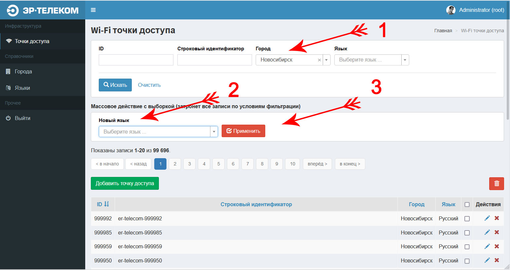

# Тестовое задание ЭР-ТЕЛЕКОМ

Веб-сервер обеспечивает API для других приложений. Бизнес владеет WiFi точками, через которые клиент авторизуется для доступа в интернет.

Требуется реализовать веб-интерфейс администратора + API для программистов приложений, которое показывает по идентификатору точки, какой язык на ней установлен по умолчанию.

Согласно бизнес-требованиям администратор приложения должен иметь возможность изменять настройки языка приложения (en, ru) по умолчанию (на конкретной точке в городе, по всем точкам города, по всем точкам).

На основе фокуса на производительность и скорость ответов предложить и обосновать схему хранения (структура таблиц + индексы) и архитектуру приложения.

* приложение на Yii2;
* использовать REST API;
* использовать миграции Yii2;
* положить код всего проекта в git (например, Bitbucket или github);
* репозиторий должен содержать README.md файл, в котором описаны требования к окружению и как запустить приложение;
* приложение не должно потреблять больше 128MB памяти в пике.

## Решение задания

### Введение
Для решения задачи был взят шаблон [Yii 2 advanced](https://github.com/yiisoft/yii2-app-advanced). Приложение было разделено на две части (API и административный интерфейс), каждая из которых имеет собственные корневые директории, файлы конфигурации и прочее. 

Это позволяет не только лучше структурировать код, но и развернуть оба приложения в разных контейнерах или распределить их по разным хостам при установке на "голое железо". 

**Структура приложения:**

```
admin/                   Содержит файлы относящиеся к административной панели
api/                     Содержит файлы относящиеся к реализации API
common/                  Содержит общие файлы (базовая конфигурация, общие модели)
console/                 Консольное приложение (создание пользователей, миграции)
vendor/                  Зависимости
environments/            Шаблоны настройки окружения
```
В качестве шаблона административного интерфейса была использована библиотека [dmstr/yii2-adminlte-asset](https://github.com/dmstr/yii2-adminlte-asset), функционал которой был доработан.


### Хранение

Для организации хранения было создано 4 таблицы:

* **user** - содержит данные о пользователях административной панели
* **city** - содержит список городов
* **language** - содержит список языков
* **wifi_spot** - содержит список точек доступа

Миграции для соответствующих таблиц, а также наполнение тестовыми данными содержится в директории `console/migrations`

#### user

Для таблицы users были добавлены следующие индексы, помимо первичного ключа:

* ADD UNIQUE KEY `idx-user-auth` (`login`,`password`) - составной, уникальный индекс, который используется при авторизации через веб-интерфейс
* ADD UNIQUE KEY `idx-user-login` (`login`) - уникальный индекс, который используется для получения пользователя по логину
* ADD UNIQUE KEY `idx-user-access_token` (`access_token`) - уникальный индекс, который используется при авторизации по API
* ADD KEY `idx-user-status` (`status`) - простой индекс, который используется для выборки по статусу пользователя

Через отдельную миграцию в таблицу вносится 1 пользователь с целью демонстрации работы.

```sql
Логин: root
Пароль: SWlfwj4e78Fsk
Токен для API: XbgOZGq1I6Q3sndSRcLdgY7MktGQFj3w
```

#### city

Город (разновидность населённого пункта) - сложная единица, для точного определения которой нужно учитывать страну, административно-территориальное деление (тип региона, регион, район) и другие локальные особенности, иначе возможны совпадения по названию.

В целях упрощения и экономии времени при выполнении тестового задания таблица была специально упрощена и содержит только **первичный ключ** и **название города**. 

Через отдельную миграцию в таблицу вносится 10 городов РФ из списка самых густонаселённых.

#### language

Структура таблицы состоит из первичного ключа, двухсимвольного кода языка (ru | en, по стандарту ISO 639-1) и текстового названия языка.

Для таблицы также создан уникальный индекс ADD UNIQUE KEY `idx-language-code` (`code`) - который служит для выборки записи по двухсимвольному коду.

Через отдельную миграцию в таблицу вносится 2 записи для русского и английского языков с целью демонстрации работы.

#### wifi_spot

Структура таблицы состоит из первичного ключа, колонок содержащих идентификатор города и языка по умолчанию. 

Также в таблицу добавлен текстовый, уникальный ключ `key` на случай, если реальная инфраструктура компании использует существующие текстовые идентификаторы точек доступа, которые потребуется импортировать в приложение и осуществлять выдачу данных по ним, а не по числовым ключам.

Через отдельную миграцию в таблицу вносится **1 миллион** тестовых записей, которые с помощью функции rand распределяются между языками и городами для имитации реального объёма данных.

**Добавлены следующие индексы:**

* ADD UNIQUE KEY `idx-wifi-spot-key` (`key`) - уникальный индекс для выборки записи по текстовому идентификатору
* ADD KEY `idx-wifi-spot-search` (`city_id`,`language_id`) - составной индекс для выборки записей по фильтру в административном интерфейсе
* ADD KEY `idx-wifi-spot-city_id` (`city_id`) - простой индекс для выборки записей по городу
* ADD KEY `idx-wifi-spot-language_id` (`language_id`) - простой индекс для выборки записей по языку

### Рабочее окружение

**Рекомендуемые требования:**

* Nginx 1.20.x
* PHP 8.0.x (FPM)
* MySQL 8.0.x
* Composer

**Минимальные требования:**

* Nginx 1.19.x / Apache 2.4.x
* PHP 7.4.x (FPM)
* MySQL 5.7.x
* Composer

Nginx + PHP-FPM значительно быстрее любой вариации с Apache. Это подверждается, как многочисленными тестами в интернете, так и из личного опыта.

С учётом фокуса на производительность были выбраны свежие версии PHP и MySQL, т.к. с ростом нагрузки оба инструмента показывают лучшие результаты. Здесь я опираюсь на тесты из интернета, т.к. опыта работы с highload на свежих версиях у меня нет.

В целом, по графикам видно, что если API не требуется обрабатывать более 1000 запросов в секунду и хранить данные о более чем 100 миллионах точек доступа, то можно остановиться на PHP 7.4 и MySQL 5.7 / MariaDB. 

Однако, в пользу новых версий говорит жизненный цикл и поддержка новых функций, которые могут пригодиться в будущем.


### Установка приложения с помощью docker compose:

1. Клонируем репозиторий

```bash
git clone https://github.com/aik27/ertelecom-api
cd ertelecom-api
```

2. Устанавливаем зависимости

```bash
composer update
```

3. Билдим контейнеры

```bash
docker-compose build
```

4. Запускаем контейнеры

```bash
docker-compose up -d
```

5. Меняем рабочее окружение на production

```bash
docker-compose exec admin php init --env=Production --overwrite=All
```

6. Применяем миграции

```bash
docker-compose exec admin php yii migrate --interactive=0
```

7. Доступ к приложению:

```bash
API: http://127.0.0.1:3132
Административная панель: http://127.0.0.1:3133

Тестовый доступ в панель:
Логин: root
Пароль: SWlfwj4e78Fsk
```

### Установка приложения вручную:

1. Клонируем репозиторий

```bash
git clone https://github.com/aik27/ertelecom-api
cd ertelecom-api
```

2. Устанавливаем зависимости

```bash
composer update
```

3. Меняем рабочее окружение на production

```bash
php init --env=Production --overwrite=All
```

4. Правим настройки соединения с БД

```bash
vi common/config/main-local.php
```

5. Применяем миграции

```bash
php yii migrate --interactive=0
```

6. Настраиваем имена серверов, корневые директории и роутинг в Nginx:

```text
    # Для API

    server_name ertelecom.api;
    root        [path to app]/api/web/;
    index       index.php;

    location / {
       try_files $uri $uri/ /index.php$is_args$args;
    }
```
```text
    # Для административной панели

    server_name panel.ertelecom.api;
    root        [path to app]/admin/web/;
    index       index.php;

    location / {
       try_files $uri $uri/ /index.php$is_args$args;
   }
```

7. Доступ к приложению:

```bash
API: http://ertelecom.api
Административная панель: http://panel.ertelecom.api

Тестовый доступ в панель:
Логин: root
Пароль: SWlfwj4e78Fsk
```

### Работа с REST API

Для выполнения условий задания API реализовано на REST контроллере. 

Поддерживается только метод `GET`

#### Получение языка точки доступа по умолчанию:

Для этого отправляем GET запрос на ресурс `/wifi/spots/{id}/language`. Где {id} - числовой индентификатор точки доступа.

При установке в докер:

```http request
GET http://127.0.0.1:3132/wifi/spots/99/language
Accept: application/json
```

При ручной установке:

```http request
GET http://ertelecom.api/wifi/spots/99/language
Accept: application/json
```


#### Получение расширенной информации о точке доступа:

```http request
GET http://127.0.0.1:3132/wifi/spots/99?expand=language,city
Accept: application/json
```


#### Получение списка точек доступа:

```http request
GET http://127.0.0.1:3132/wifi/spots?expand=language,city
Accept: application/json
```


Подробнее о том, как запрашивать отдельные поля и присоединять к запросу связанные данные:
https://www.yiiframework.com/doc/guide/2.0/ru/rest-resources#fields

Подробнее о том, как пользоваться постраничной навигацией:
https://www.yiiframework.com/doc/guide/2.0/ru/rest-resources#collections

#### Изменение формата ответов:

Сервис поддерживает ответы в JSON и XML. 

Для уточнения формата нужно в запросе заголовок `Accept`

* application/json
* application/xml

**Пример:**
```http request
GET http://127.0.0.1:3132/wifi/spots?expand=language,city
Accept: application/xml
```

#### Авторизация:

Для API реализована авторизация на основе `access_token`

Для включения авторизации необходимо расскоментировать ключи `as authenticator` и `as access` в файле `/api/config/main.php`

После этого все запросы должны передавать `access_token` который будет сопоставляться с соответствующим полем в таблице `users`. 

**Пример:**
```http request
GET http://127.0.0.1:3132/wifi/spots/99/language?access_token=XbgOZGq1I6Q3sndSRcLdgY7MktGQFj3w
Accept: application/json
```

В целях упрощения токен является бессрочным.

### Управление пользователями административного интерфейса и API

Для этого реализована консольная утилита:

```php
yii user/create - создаёт нового пользователя
yii user/remove - удаляет пользователя
yii user/change-password - изменяет пароль пользователя
yii user/change-token - изменяет токен для API
```

### Работа с административным интерфейсом

Административный интерефейс поддерживает следующие функции:

* Авторизация оператора по логину и паролю
* Поиск, добавление, редактирование, удаление городов
* Поиск, добавление, редактирование, удаление языков
* Поиск, добавление, редактирование, удаление точек доступа
* Групповое изменение языка по умолчанию для точек доступа

```bash
Административная панель: http://127.0.0.1:3133
Логин: root
Пароль: SWlfwj4e78Fsk
```

#### Изменения языка для всех точек доступа:

1. Перейдите в раздел "Точки доступа", ссылка на который находится справа в сайдбаре.
2. Не меняя параметры фильтрации выберите новый язык (стрелка №1)
3. Нажмите кнопку применить (стрелка №2)


#### Изменения языка для конкретного города:

1. Перейдите в раздел "Точки доступа", ссылка на который находится справа в сайдбаре.
2. Выберите город в выпадающем списке (стрелка №1)
3. Выберите новый язык (стрелка №2)
4. Нажмите кнопку применить (стрелка №3)



#### Изменения языка для конкретной точки доступа:

1. Перейдите в раздел "Точки доступа", ссылка на который находится справа в сайдбаре.
2. Выберите необходимую точку доступа и нажмите на знак карандаша справа (указан стрелкой)


3. Выберите новый язык (стрелка №1)
4. Нажмите кнопку "Редактировать запись (стрелка №2)


